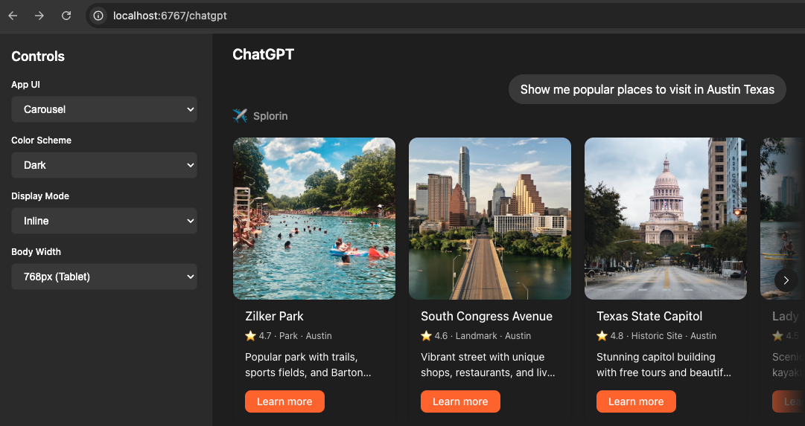

# sunpeak

React library for cross-platform genAI App UIs. Supports **OpenAI ChatGPT Apps**, with pluggable architecture for **Gemini**, **Claude**, and other platforms.



**Key Features:**
- 📺 ChatGPT simulator for rapid UI component development.
- 🧑‍💻 Interface for cross-platform custom components.
  - Unified frontend API and design system.
- 📱 Library of approved Apps and components.
- 🧪 Test advanced platform behavior locally.

## Development Quickstart

Requirements: Node 18+, pnpm 8+

```bash
pnpm run dev
```

## Building Apps

### Use a library App

```tsx
import { Carousel, Card } from 'sunpeak';

export const MyCarousel = () => (
  <Carousel>
    <Card
      image="https://sunpeak.ai/images/sun.svg"
      imageAlt="Sunpeak logo"
      imageMaxWidth={400}
      imageMaxHeight={400}
      header="Card Title"
    >
      Card content
    </Card>
  </Carousel>
);
```

### Create a custom App

```tsx
import { GenAI } from 'sunpeak';
import 'sunpeak/dist/index.css';

export const MyApp = GenAI(({ maxHeight, colorScheme }) => (
  <div style={{ padding: '20px' }}>
    <h2>Hello GenAI!</h2>
    <p>Theme: {colorScheme}</p>
    <p>Available height: {maxHeight}px</p>
  </div>
));
```
## Supported Platforms

- ✅ **OpenAI ChatGPT** - Fully supported ([design guidelines](https://developers.openai.com/apps-sdk/concepts/design-guidelines))
- 🔄 **Google Gemini** - Design system available (SDK support coming soon)
- 🔄 **Anthropic Claude** - Design system available (SDK support coming soon)
- 🔧 **Custom platforms** - Implement your own platform adapter

### Platform Auto-Detection

Sunpeak automatically detects the active platform. No configuration needed for basic usage!

## What's Included

### Components
- **GenAI Component** - Create platform-aware Apps with automatic theming
  - Enforce requirements imposed by App platforms
  - Provide a unified interface for App platform interactions
- **Card** - Responsive card component that adapts to display mode
- **Carousel** - Horizontal scrolling carousel for multiple cards
- **Button** - Action button with required onClick and optional isPrimary styling

### Hooks
- **usePlatformGlobal** - Platform-agnostic global state access
- **useDisplayMode** - Get current display mode
- **useRequestDisplayMode** - Request a specific display mode (e.g., fullscreen)
- **useWidgetProps** - Access tool output data
- **useWidgetState** - Manage persistent widget state
- **useMaxHeight** - Get height constraints

### Design Systems
- **ChatGPT** - Default, follows Apps SDK guidelines
- **Gemini** - Google's design language (placeholder)
- **Claude** - Anthropic's design language (placeholder)
- **Custom** - Build your own via CSS variables

**See [THEMING.md](./THEMING.md)** for creating custom design systems and complete theming documentation.

## Deployment

Automatically publishes to npm when a new release is created on GitHub:
1. Runs all CI checks (lint, test, build)
2. Publishes to npm

## Resources

- [OpenAI ChatGPT Apps SDK Design Guidelines](https://developers.openai.com/apps-sdk/concepts/design-guidelines)
- [OpenAI ChatGPT Apps SDK Examples](https://github.com/openai/openai-apps-sdk-examples)
- [Theming Guide](./THEMING.md)

## License

MIT
