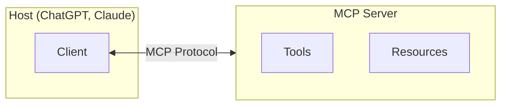
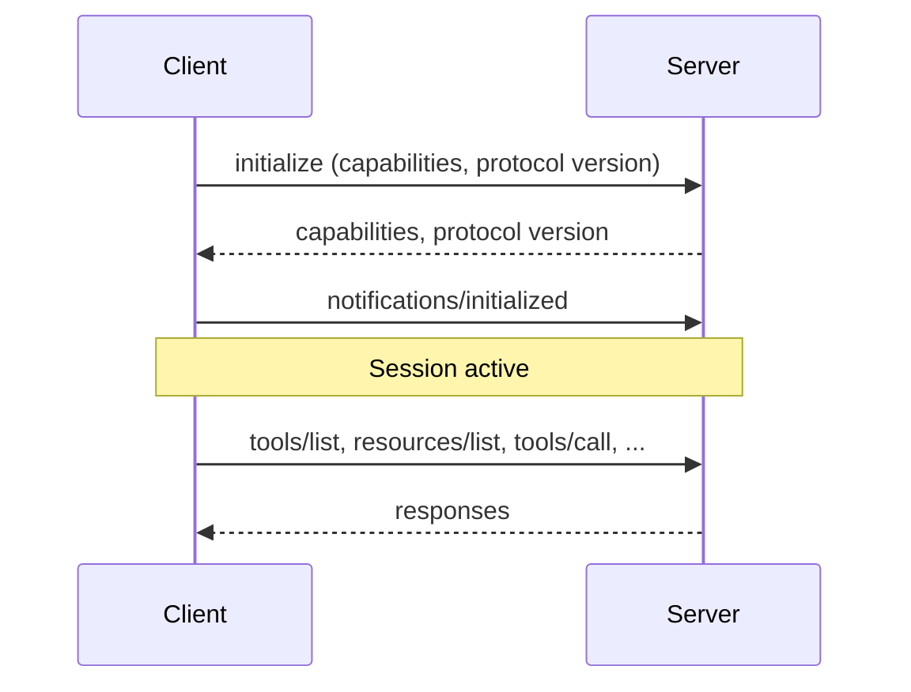

## What is MCP?

The Model Context Protocol (MCP) is an open standard for connecting AI models to external data and capabilities. It defines how AI hosts like ChatGPT and Claude communicate with servers that expose [tools](/mcp-apps/mcp/tools) and [resources](/mcp-apps/mcp/resources).

## Architecture

- **Host** — An AI application (ChatGPT, Claude) that initiates connections to servers. Each host runs one or more clients.
- **Client** — A protocol client within the host that maintains a 1:1 connection to a server. Handles capability negotiation, request routing, and session management.
- **Server** — A program that exposes tools, resources, and other capabilities over MCP. Servers are stateless between sessions.

## Transports

MCP defines two standard transports:

- **stdio** — Communication over standard input/output. Used for local servers running as subprocesses.
- **Streamable HTTP** — Communication over HTTP with server-sent events. Used for remote servers accessible over the network.

## Connection Lifecycle

1. The client sends `initialize` with its capabilities and preferred protocol version.
2. The server responds with its own capabilities and the negotiated protocol version. The response can also include an optional `instructions` string the host may surface to the model (e.g., as part of the system prompt) to describe cross-tool relationships and constraints.
3. The client sends `notifications/initialized` to confirm the session is ready.
4. Requests flow in both directions for the duration of the session.

## What Can Servers Expose?

MCP defines three types of capabilities that servers can expose:

- **[Tools](/mcp-apps/mcp/tools)** — Functions the model can call. Used for actions like fetching data, running computations, or modifying state.
- **[Resources](/mcp-apps/mcp/resources)** — Data the model can read. Identified by URIs with MIME types. Used for structured data, files, and (in MCP Apps) interactive HTML UIs.
- **Prompts** — Reusable prompt templates. Not currently used by MCP Apps.

## Learn More

<Card horizontal title="Model Context Protocol" icon="link" href="https://modelcontextprotocol.io/">
  Full MCP specification and documentation.
</Card>
<Card horizontal title="MCP Apps Introduction" icon="page" href="/mcp-apps/introduction">
  How MCP Apps extends MCP with interactive UIs.
</Card>
