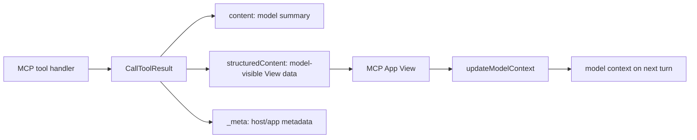

<Badge color="green">MCP Apps SDK</Badge>

MCP App data crosses three boundaries: the model reads the tool result, the View renders the UI, and the host manages the iframe and conversation state. Use the right field for each boundary so text-only MCP clients keep working, the View does not scrape text, and private component data does not leak into model context.

## Field Guide

| Field                | Set by                                 | Read by                              | Use it for                                                                   |
| -------------------- | -------------------------------------- | ------------------------------------ | ---------------------------------------------------------------------------- |
| `content`            | Tool handler                           | Model, host, View, text-only clients | Short human-readable summary and recoverable errors.                         |
| `structuredContent`  | Tool handler                           | Model, View, and compatible clients  | Typed data the model may read and the UI renders, matching `outputSchema`.   |
| `_meta`              | Tool handler or resource read callback | Host and app runtime                 | Component-only metadata, IDs, hints, CSP, iframe permissions, or host data. |
| `outputSchema`       | Tool definition                        | Host, clients, SDK validation        | Contract for `structuredContent`.                                            |
| `updateModelContext` | View                                   | Model on later turns                 | Current UI state the model should know after the app renders.                |

## Result Flow



The first model-called tool should return enough `content` for a non-UI host to answer the user. The View should render `structuredContent`, not parse `content`. Treat `structuredContent` as model-visible, so it should contain only data the model can safely use.

## Return Both Text and Structured Data

```ts
const SearchOrdersOutputSchema = {
  query: z.string(),
  orders: z.array(
    z.object({
      id: z.string(),
      status: z.enum(['open', 'shipped', 'cancelled']),
      total: z.number(),
    })
  ),
  nextCursor: z.string().optional(),
};

registerAppTool(
  server,
  'search-orders',
  {
    title: 'Search Orders',
    description: 'Search orders and display the matching results.',
    inputSchema: { query: z.string() },
    outputSchema: SearchOrdersOutputSchema,
    annotations: { readOnlyHint: true, openWorldHint: false },
    _meta: {
      ui: { resourceUri: 'ui://orders/search.html' },
    },
  },
  async ({ query }) => {
    const result = await searchOrders(query);

    return {
      content: [
        {
          type: 'text',
          text: `Found ${result.orders.length} orders for "${query}".`,
        },
      ],
      structuredContent: result,
    };
  }
);
```

The text block keeps the result useful in normal MCP clients. `structuredContent` gives the model and the View a stable object shape.

## What Goes in `content`

Use `content` for facts the model may need immediately:

- What the tool did.
- Counts, totals, statuses, or identifiers that answer the user.
- Error messages the model can recover from.
- A compact summary when the full data is too large.

Avoid full tables, raw files, private UI state, and long logs in `content`. If the user later chooses a row or filter in the View, send that selection with [`updateModelContext`](/mcp-apps/app/requests/update-model-context).

## What Goes in `structuredContent`

Use `structuredContent` for model-safe UI payloads:

- Rows, chart series, map markers, cards, media metadata, or form defaults.
- Pagination cursors and IDs the View needs for app-only tool calls.
- Status objects that drive loading, success, and error UI.

Declare `outputSchema` for model-called UI tools and for app-only tools whose responses the View depends on. The schema documents the contract and helps clients validate the result. Do not put private or oversized data in `structuredContent`; use `_meta` or an app-only tool instead.

## What Goes in `_meta`

Use `_meta` only for data that should not be part of the model-readable answer:

- Internal request IDs, cache keys, trace IDs, or view IDs.
- Host-specific rendering hints.
- Resource `_meta.ui` such as CSP, permissions, `domain`, and `prefersBorder`.
- Data that the View can use but the model should not see or rely on.

Do not hide user-visible facts in `_meta`. Hosts and clients may treat `_meta` as implementation metadata, and the model should not need it to answer.

```ts
return {
  content: [{ type: 'text', text: 'Loaded invoice inv_123.' }],
  structuredContent: { invoiceId: 'inv_123', total: 42.5 },
  _meta: {
    traceId: 'req_abc123',
    renderedAt: new Date().toISOString(),
  },
};
```

## Keep the Model Current After UI Changes

Tool results describe the state at tool-call time. After the user interacts with the View, call `updateModelContext` with the small set of facts the model should know on later turns.

```ts
await app.updateModelContext({
  content: [
    {
      type: 'text',
      text: 'The user selected order ord_123 and is viewing the shipping tab.',
    },
  ],
  structuredContent: {
    selectedOrderId: 'ord_123',
    activeTab: 'shipping',
  },
});
```

Each call overwrites the previous app context. Send the complete current state you want the model to retain, not just a patch.

## App-only Tool Results

App-only tools still return normal MCP tool results. Keep `content` short for logs and debugging, put model-safe data in `structuredContent`, and put component-only data in `_meta`.

```ts
registerAppTool(
  server,
  'load-orders-page',
  {
    title: 'Load Orders Page',
    description: 'Load another page of order results for the app UI.',
    inputSchema: { cursor: z.string().optional() },
    outputSchema: SearchOrdersOutputSchema,
    _meta: {
      ui: { visibility: ['app'] },
    },
  },
  async ({ cursor }) => {
    const page = await loadOrdersPage(cursor);

    return {
      content: [{ type: 'text', text: `Loaded ${page.orders.length} more orders.` }],
      structuredContent: page,
    };
  }
);
```

The model never sees this tool in its tool list, but the result shape still matters because the View calls it through [`callServerTool`](/mcp-apps/app/requests/call-server-tool).

## Checklist

- Return `content` on every model-visible tool result.
- Render `structuredContent` in the View instead of parsing text.
- Add `outputSchema` for structured UI payloads.
- Treat `structuredContent` as model-visible.
- Use `_meta` for component-only data, not facts the model must know.
- Use app-only tools for pagination, polling, submit buttons, and refresh actions.
- Call `updateModelContext` after user selections that should affect future model replies.
- Keep each model context update complete because the previous one is overwritten.

## Related

<CardGroup cols={2}>
  <Card
    title="Tool and Resource Contract"
    icon="list-check"
    href="/mcp-apps/server/tool-resource-contract"
  >
    Check the full server-side MCP App contract.
  </Card>
  <Card
    title="content vs structuredContent vs _meta"
    icon="split"
    href="/mcp-apps/server/content-structuredcontent-meta"
  >
    Choose the correct data channel for each tool result field.
  </Card>
  <Card title="Tool _meta" icon="tag" href="/mcp-apps/server/tool-meta">
    Link tools to Views and control model vs app visibility.
  </Card>
  <Card
    title="updateModelContext"
    icon="message-square"
    href="/mcp-apps/app/requests/update-model-context"
  >
    Push View state into future model turns.
  </Card>
  <Card title="useToolData" icon="code" href="/app-framework/hooks/use-tool-data">
    Read tool input and structured output in sunpeak React resources.
  </Card>
</CardGroup>
